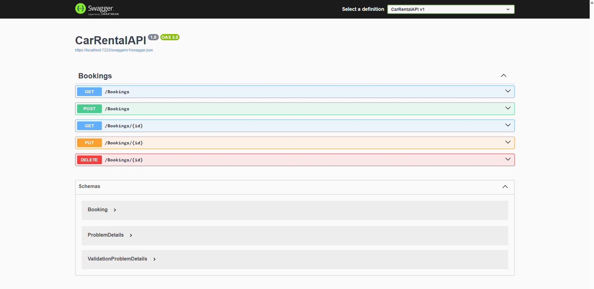
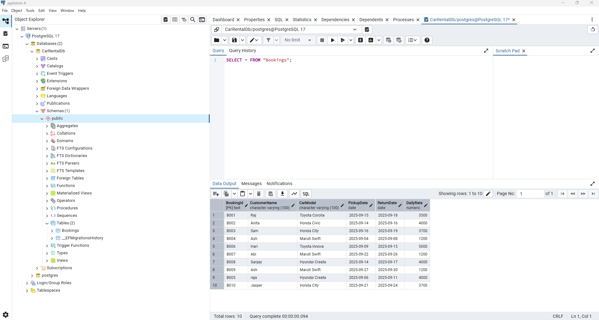
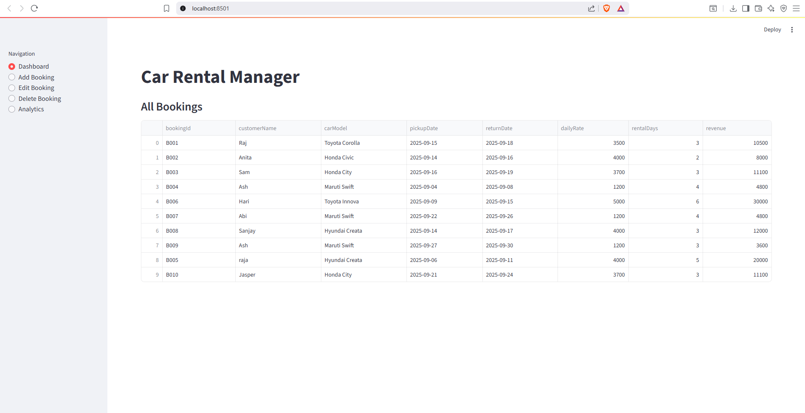
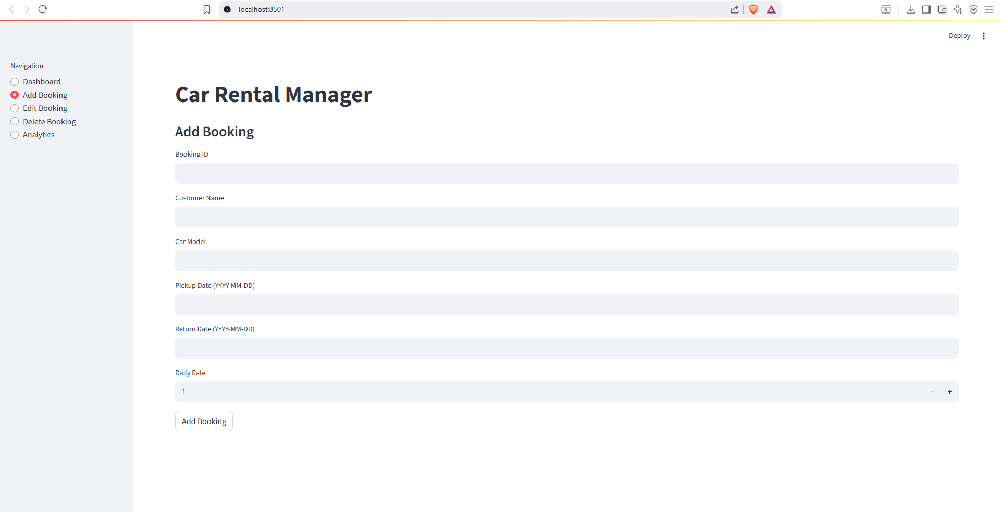
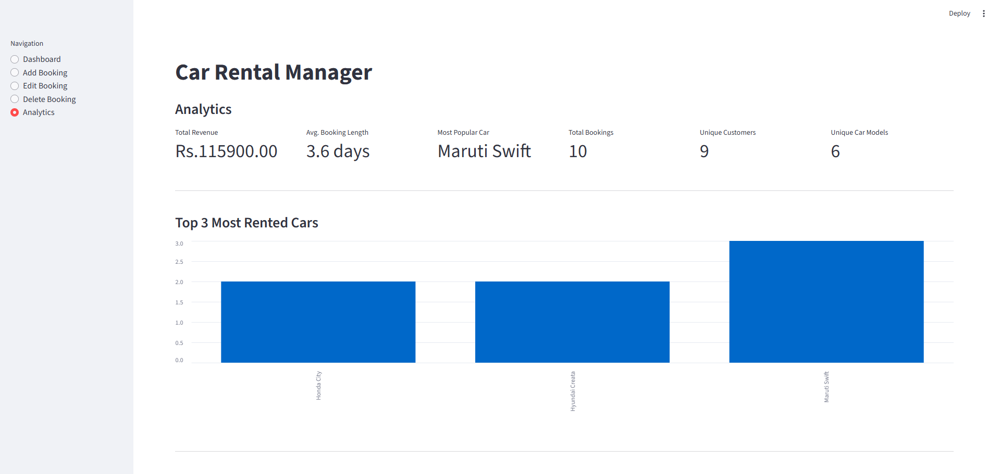

# Car Rental Manager

A simple Car Rental management system with a **.NET Web API** and a **Python Streamlit dashboard** for CRUD operations and analytics.

## Features

- **CRUD Operations**: Add, Edit, Delete, and View Bookings via API or Streamlit UI.
- **Analytics Dashboard**:
  - Total revenue
  - Average booking length
  - Most popular car
  - Number of rentals per car model
- **Data Export**: Download bookings and analytics as CSV or JSON.
- **PostgreSQL Backend** with `DateOnly` fields for clean date handling.

## Technologies Used

- **Backend:** .NET 8 Web API, Entity Framework Core
- **Frontend / Analytics:** Python, Streamlit, Pandas, Matplotlib
- **Database:** PostgreSQL
- **HTTP Client:** Requests (Python)

## 1. PostgreSQL Database

1. Install PostgreSQL.
2. Create a database named `CarRentalDb`.
3. Run EF Core migrations:
dotnet ef database update --context CarRentalContext

(Optional) Seed sample data using your DbInitializer class. (By Default has Seed data).

## 2. Run CarRentalAPI Project to start the API

1. Open the solution in Visual Studio or VS Code.
2. Restore NuGet packages:dotnet restore

Run the project: dotnet run --project CarRentalAPI or Use VS/VSCode.

The API will be available at: http://localhost:5101/bookings. Swagger UI will be automatically opened and Funtionalities (API endpoints) can be consumed (CRUD).

## 3. Sample API Requests and Responses

### GET all bookings

Request: 
GET http://localhost:5101/bookings

Response (200 OK):
[
  {
    "bookingId": "B001",
    "customerName": "Raj",
    "carModel": "Toyota Corolla",
    "pickupDate": "2025-08-15",
    "returnDate": "2025-08-18",
    "dailyRate": 55
  },
  {
    "bookingId": "B002",
    "customerName": "Anita",
    "carModel": "Honda Civic",
    "pickupDate": "2025-08-14",
    "returnDate": "2025-08-16",
    "dailyRate": 60
  }
]

### GET a single booking

Request:
GET http://localhost:5101/bookings/B001

Response (200 OK):
{
  "bookingId": "B001",
  "customerName": "Raj",
  "carModel": "Toyota Corolla",
  "pickupDate": "2025-08-15",
  "returnDate": "2025-08-18",
  "dailyRate": 55
}

### POST a new booking

Request:
POST http://localhost:5101/bookings
Content-Type: application/json
{
  "bookingId": "B003",
  "customerName": "Sam",
  "carModel": "Honda City",
  "pickupDate": "2025-08-16",
  "returnDate": "2025-08-19",
  "dailyRate": 70
}

Response (201 Created):
{
  "bookingId": "B003",
  "customerName": "Sam",
  "carModel": "Honda City",
  "pickupDate": "2025-08-16",
  "returnDate": "2025-08-19",
  "dailyRate": 70
}

### PUT update a booking

Request:
PUT http://localhost:5101/bookings/B003
Content-Type: application/json
{
  "bookingId": "B003",
  "customerName": "Samuel",
  "carModel": "Honda City",
  "pickupDate": "2025-08-17",
  "returnDate": "2025-08-20",
  "dailyRate": 75
}

Response (200 OK):
{
  "bookingId": "B003",
  "customerName": "Samuel",
  "carModel": "Honda City",
  "pickupDate": "2025-08-17",
  "returnDate": "2025-08-20",
  "dailyRate": 75
}

### DELETE a booking

Request:
DELETE http://localhost:5101/bookings/B003

Response (200 OK):
{
  "message": "Booking deleted successfully."
}

## 4. Car Rental  Booking Management & Analytics (Streamlit App for CRUD & Analytics)

This Python Streamlit application provides a user-friendly interface for managing car rental bookings and visualizing analytics. It interacts with the .NET Web API backend to perform CRUD operations and display real-time data insights.
Features:
- **Booking Management** (CRUD)
    - Add new bookings
    - Edit existing bookings
    - Delete bookings
    - View all bookings in a table
- **Analytics Dashboard**
    - Total revenue from bookings
    - Average booking duration
    - Most popular car models
    - Number of rentals per car model (visualized in charts)
- **Data Export**
    - Download bookings and analytics data as CSV or JSON files
    - How to Run
    - Install Python dependencies:

### How to Run
Install Python dependencies: pip install streamlit pandas matplotlib requests
Run the Streamlit app: streamlit run CarRentalManager.py
Automatically Opens the streanlit app in browser (usually http://localhost:8501).

## Screenshots

### 1. Swagger UI API

### 2. PostgreSQL Database

### 3. Dashboard Overview

### 4. Add/Edit Booking

### 5. Analytics Charts

## Author
### SAI ASWIN KUMAR J | Email: saiaswinjanarthanan@gmail.com