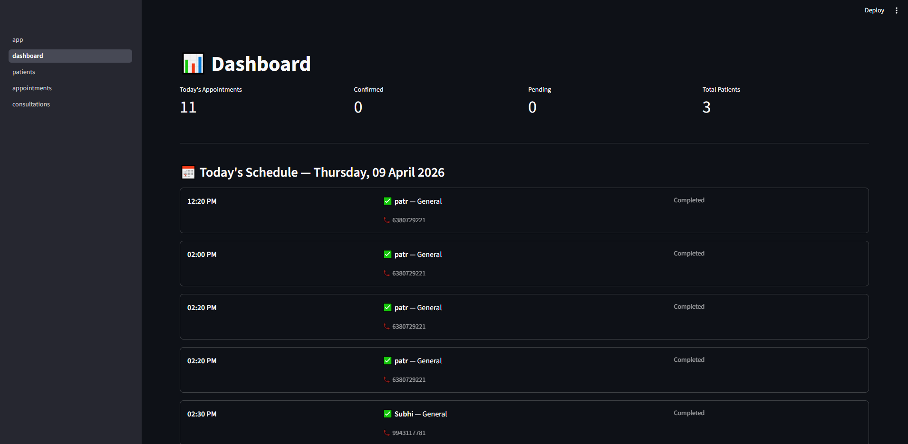
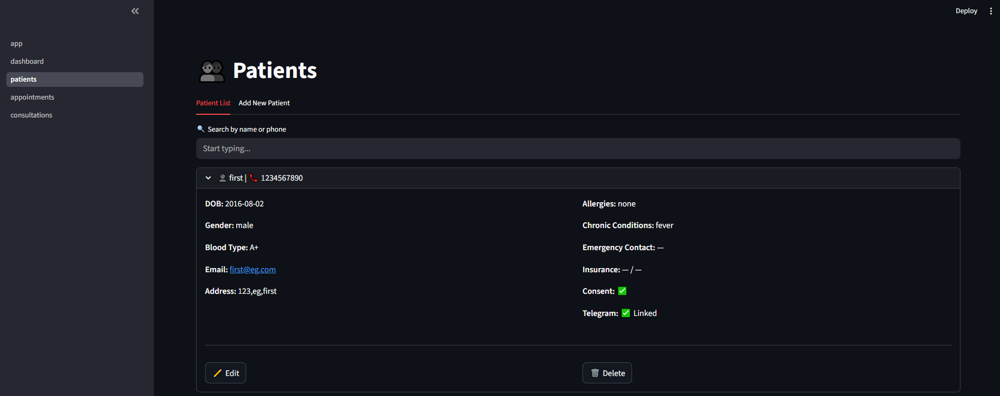
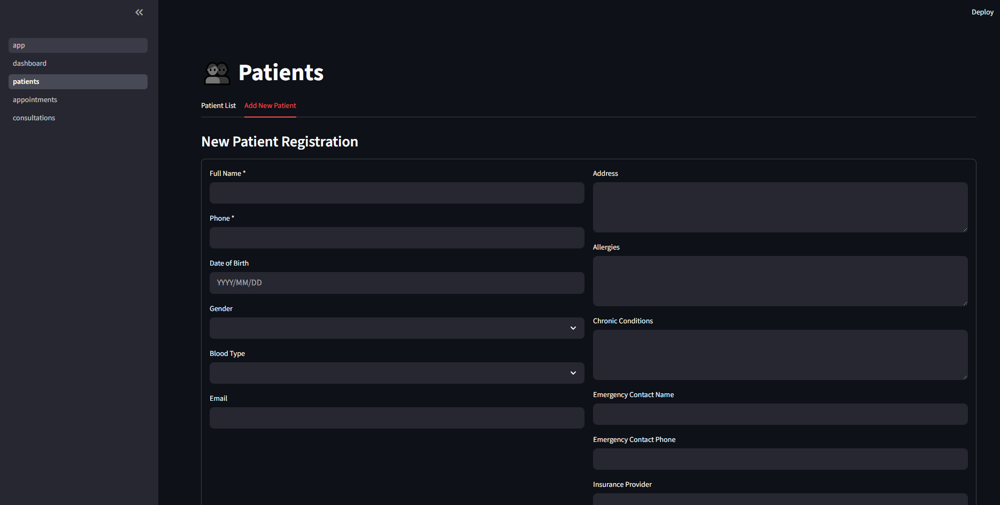
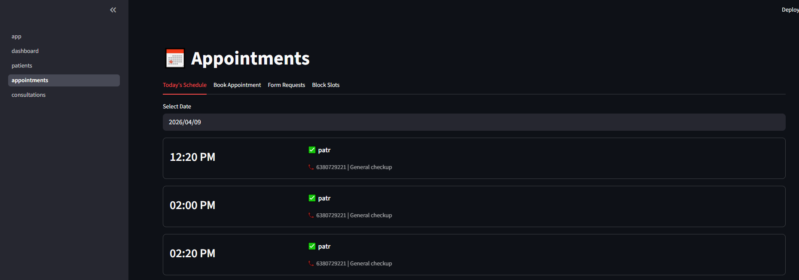
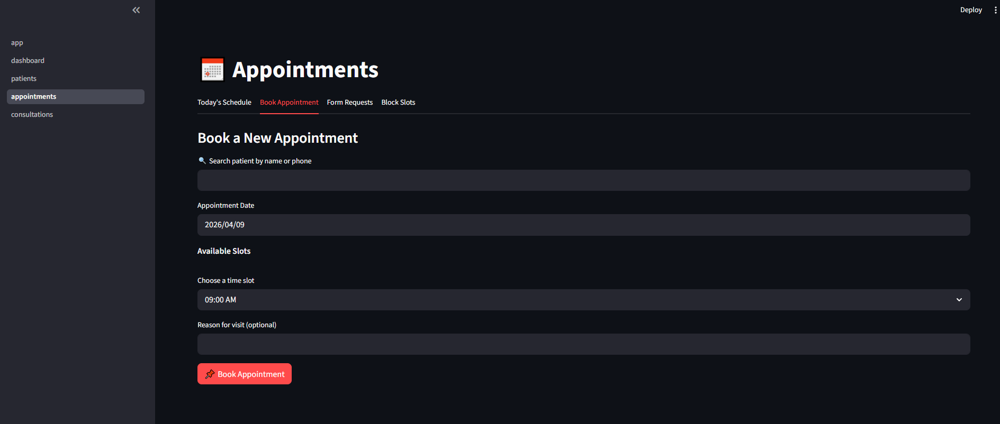
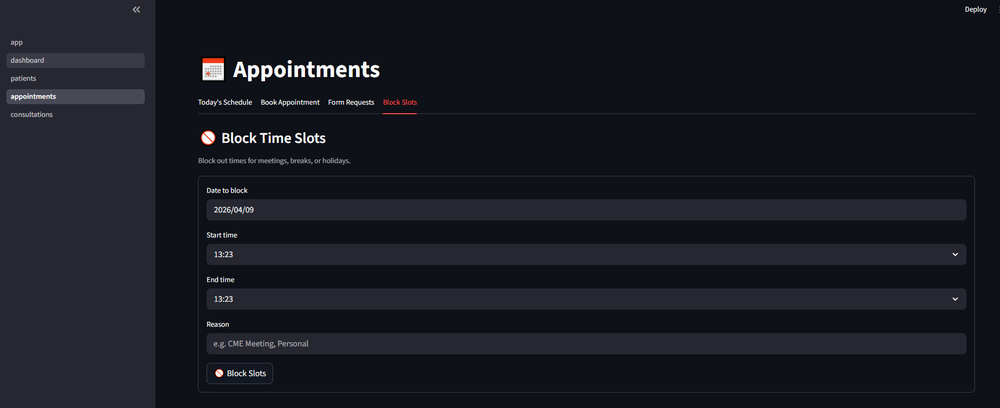
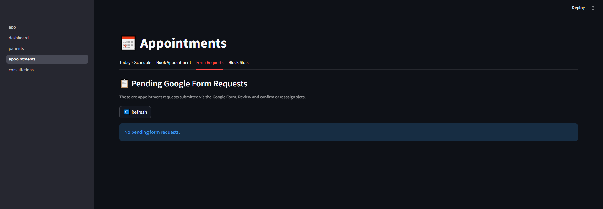
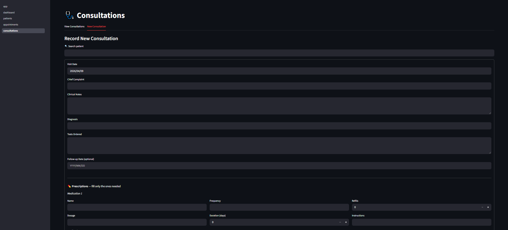
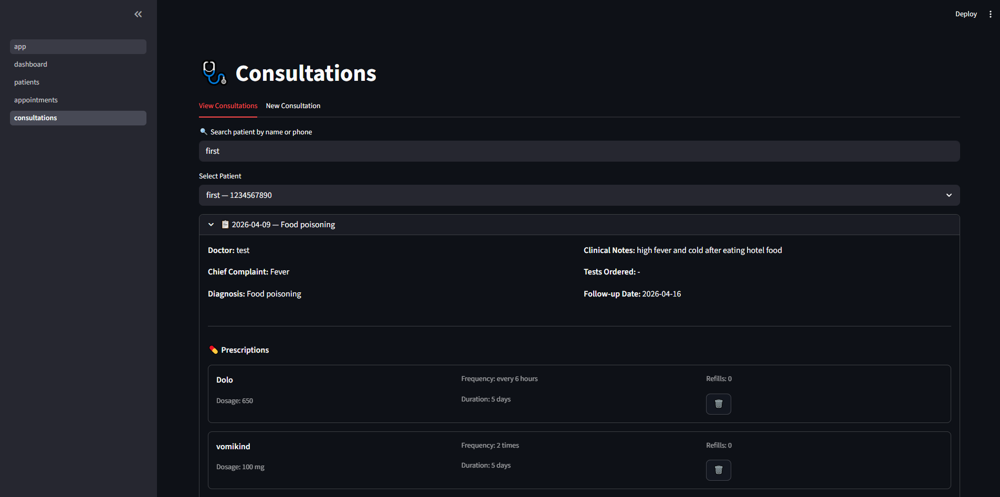

# Cliniqo — A Simple Clinic Patient Management System

A locally hosted clinic management system built for small clinics (2-5 staff). Manages patient records, consultations, prescriptions, and appointments with automated Gmail and Telegram notifications.

Built with Python and Streamlit, backed by a local PostgreSQL database. Designed with data privacy in mind, following India's DPDP Act guidelines.

---

## Features

- **Patient Management** — Register, view, edit, and delete patient records with full medical history and consent tracking
- **Appointment Booking** — 10-minute time slots, duplicate prevention, Sunday blocking, ad-hoc slot blocking
- **Consultations** — Record diagnosis, clinical notes, tests ordered, and up to 5 prescriptions in one form
- **Notifications** — Automatic Gmail and Telegram messages on appointment confirmation and after consultations
- **Dashboard** — Today's schedule at a glance with key metrics
- **Role-Based Access** — Doctor, Nurse, and Receptionist roles with different permissions
- **Audit Logging** — Every change is logged with user, action, and timestamp
- **Multi-Staff Access** — All staff connect via browser on local clinic network
- **DPDP Act Compliant** — Consent recording, audit trails, on-premise data storage

---

## Tech Stack

| Layer | Technology |
|---|---|
| UI / Frontend | Streamlit (Python) |
| Database | PostgreSQL (local) |
| Language | Python 3.10+ |
| Notifications | Gmail SMTP + Telegram Bot API |
| Appointment Intake | Google Forms + Google Sheets (optional) |

---

## Architecture

The project follows a 3-Layer Architecture:

```
Presentation Layer  (pages/)       — Streamlit UI, no business logic
Service Layer       (services/)    — Business rules, validation, notifications
Repository Layer    (repositories/)— All SQL queries, no business logic
```

---

## Project Structure

```
clinic-app/
|
|-- app.py                         Entry point, login, sidebar navigation
|-- create_admin.py                One-time script to create first doctor account
|-- requirements.txt               Python dependencies
|-- .env                           Environment variables (never commit this)
|-- .env.example                   Template for environment variables
|
|-- pages/
|   |-- 1_dashboard.py             Today's schedule and metrics
|   |-- 2_patients.py              Patient CRUD
|   |-- 3_appointments.py          Booking, schedule, slot blocking
|   |-- 4_consultations.py         Consultations and prescriptions
|
|-- services/
|   |-- patient_service.py         Patient business logic
|   |-- appointment_service.py     Slot management and booking rules
|   |-- consultation_service.py    Consultation and prescription logic
|   |-- notification_service.py    Gmail and Telegram notifications
|   |-- telegram_listener.py       Bot that registers patients on Telegram
|
|-- repositories/
|   |-- patient_repo.py            SQL queries for patients
|   |-- appointment_repo.py        SQL queries for appointments
|   |-- consultation_repo.py       SQL queries for consultations and prescriptions
|   |-- audit_repo.py              SQL queries for audit logs
|
|-- models/
|   |-- models.py                  Data classes (Patient, Appointment, etc.)
|
|-- utils/
|   |-- result.py                  Result object pattern
|   |-- slot_generator.py          Time slot generation logic
|
|-- db/
|   |-- schema.sql                 All CREATE TABLE statements
|   |-- connection.py              PostgreSQL connection pool
|
|-- google_sheets/
|   |-- sync.py                    Google Forms sync (optional)
```

---

## Installation Guide

### Prerequisites

- Windows 10/11 (or Mac/Linux)
- Python 3.10 or higher — [python.org](https://www.python.org/downloads/)
- PostgreSQL 15 or higher — [postgresql.org](https://www.postgresql.org/download/)
- Git — [git-scm.com](https://git-scm.com/)

---

### Step 1 — Clone the Repository

```bash
git clone https://github.com/jsak98/Projects.git
cd Projects/HospitalManagementSystem
```

---

### Step 2 — Create the Database

Open a terminal and connect to PostgreSQL:

```bash
# Windows (adjust version number if needed)
"C:\Program Files\PostgreSQL\18\bin\psql.exe" -U postgres

# Mac/Linux
psql -U postgres
```

Run this inside psql:

```sql
CREATE DATABASE clinic_db;
\q
```

Then run the schema to create all tables:

```bash
# Windows
"C:\Program Files\PostgreSQL\18\bin\psql.exe" -U postgres -d clinic_db -f schema.sql

# Mac/Linux
psql -U postgres -d clinic_db -f db/schema.sql
```

---

### Step 3 — Set Up Python Environment

```bash
# Create virtual environment
python -m venv venv

# Activate it
# Windows:
venv\Scripts\activate
# Mac/Linux:
source venv/bin/activate

# Install dependencies
pip install -r requirements.txt
```

---

### Step 4 — Configure Environment Variables

```bash
# Windows
copy .env.example .env

# Mac/Linux
cp .env.example .env
```

Open `.env` and fill in your values:

```env
# PostgreSQL
DB_HOST=localhost
DB_PORT=5432
DB_NAME=clinic_db
DB_USER=postgres
DB_PASSWORD=your_postgres_password

# Gmail (see setup below)
GMAIL_SENDER=yourclinic@gmail.com
GMAIL_APP_PASSWORD=xxxx xxxx xxxx xxxx

# Telegram (see setup below)
TELEGRAM_BOT_TOKEN=your_bot_token_here

# Google Sheets (optional)
GOOGLE_SHEET_ID=your_sheet_id_here
```

---

### Step 5 — Create Doctor Account

```bash
python create_admin.py
```

Enter the doctor's name, email, and password when prompted.

---

### Step 6 — Run the App

```bash
streamlit run app.py
```

Open your browser at **http://localhost:8501**

---

### Step 7 — Run Telegram Bot (second terminal)

Open a new terminal in the same folder:

```bash
venv\Scripts\activate
python services/telegram_listener.py
```

Keep this running so patients can register on Telegram.

---

## Gmail Setup

1. Go to **myaccount.google.com → Security**
2. Enable **2-Step Verification** if not already on
3. Search **"App Passwords"** in the search bar
4. Create one → App name: `Clinic App`
5. Copy the 16-character password into `.env` as `GMAIL_APP_PASSWORD`

---

## Telegram Bot Setup

1. Open Telegram → search **@BotFather**
2. Send `/newbot`
3. Enter a name and username for your bot
4. Copy the token into `.env` as `TELEGRAM_BOT_TOKEN`

**How patients register:**
1. Patient opens Telegram → searches your bot → presses **START**
2. Bot asks for their phone number
3. Patient sends their registered phone number
4. Account is linked — all future notifications go to their Telegram

---

## Multi-Staff Access (Local Network)

To allow nurses and receptionists to access the app from other devices on the same WiFi:

```bash
streamlit run app.py --server.address 0.0.0.0
```

Staff open: `http://[your-machine-ip]:8501`

Find your IP address:
```bash
# Windows
ipconfig

# Mac/Linux
ifconfig
```

---

## Role Permissions

| Feature | Doctor | Nurse | Receptionist |
|---|---|---|---|
| View patients | Yes | Yes | No |
| Add / Edit patients | Yes | Yes | No |
| Delete patients | Yes | No | No |
| Record consultations | Yes | No | No |
| Add prescriptions | Yes | No | No |
| Book appointments | Yes | Yes | Yes |
| Confirm / Cancel appointments | Yes | Yes | Yes |
| Block slots | Yes | No | No |
| View audit logs | Yes | No | No |

---

## Appointment Slot Logic

```
Monday to Saturday
Morning : 09:00 to 13:00  (24 slots)
Lunch   : 13:00 to 14:00  (blocked)
Evening : 14:00 to 18:00  (24 slots)
Total   : 48 slots per day, 10 minutes each
Sunday  : Closed
```

Duplicate prevention rules (enforced at both app and database level):
- Only one active appointment per time slot per day
- Only one active appointment per patient per day
- Exception: if status is completed or cancelled, patient can rebook the same day

---

## Database Backup

Run this daily to back up patient data:

```bash
# Windows
"C:\Program Files\PostgreSQL\18\bin\pg_dump.exe" -U postgres clinic_db > backup.sql

# Mac/Linux
pg_dump -U postgres clinic_db > backup.sql
```

To restore:

```bash
# Windows
"C:\Program Files\PostgreSQL\18\bin\psql.exe" -U postgres clinic_db < backup.sql

# Mac/Linux
psql -U postgres clinic_db < backup.sql
```

---

## Google Forms Integration (Optional)

For patients to self-book appointments via a Google Form:

1. Create a Google Form with fields: Full Name, Phone Number, Preferred Date (DD/MM/YYYY), Preferred Time (HH:MM), Reason for Visit
2. Link form to a Google Sheet (Responses tab → Sheets icon)
3. Go to **console.cloud.google.com** → enable Google Sheets API and Google Drive API
4. Create a Service Account → download `credentials.json` → place in project root
5. Share the Google Sheet with the service account email (Editor access)
6. Add `GOOGLE_SHEET_ID` to `.env`
7. Run the sync:

```bash
python google_sheets/sync.py
```

To auto-sync every 5 minutes on Linux/Mac:
```bash
crontab -e
# Add:
*/5 * * * * cd /path/to/clinic-app && venv/bin/python google_sheets/sync.py
```

---

## DPDP Act Compliance (India)

- Patient consent recorded with timestamp at registration
- All data changes logged in `audit_logs` table
- Patient data can be deleted on request (doctor only)
- Data stays on-premise, never leaves clinic network
- Passwords hashed with bcrypt
- Credentials kept in `.env`, excluded from version control

---

## Environment Variables Reference

| Variable | Description |
|---|---|
| DB_HOST | PostgreSQL host (localhost) |
| DB_PORT | PostgreSQL port (5432) |
| DB_NAME | Database name (clinic_db) |
| DB_USER | Database user |
| DB_PASSWORD | Database password |
| GMAIL_SENDER | Clinic Gmail address |
| GMAIL_APP_PASSWORD | 16-character Google App Password |
| TELEGRAM_BOT_TOKEN | Token from @BotFather |
| GOOGLE_SHEET_ID | Google Sheet ID for appointment form |

---

## License

This project is for private clinic use. All patient data is confidential.

---

## Screenshots

### Dashboard


### Patient List


### New Patient Registration


### Appointments


### Book Appointment


### Block Slots


### Online Booking via Google Forms


### Record New Consultation


### View Consultations


---

## Author

**SAI ASWIN KUMAR J**
Email: saiaswinjanarthanan@gmail.com
