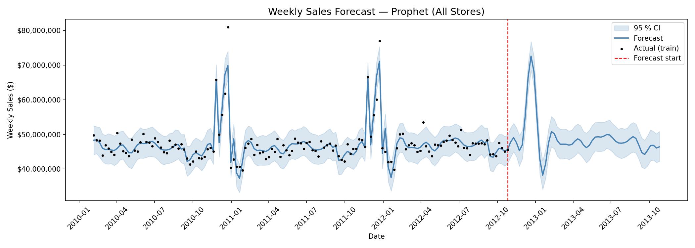
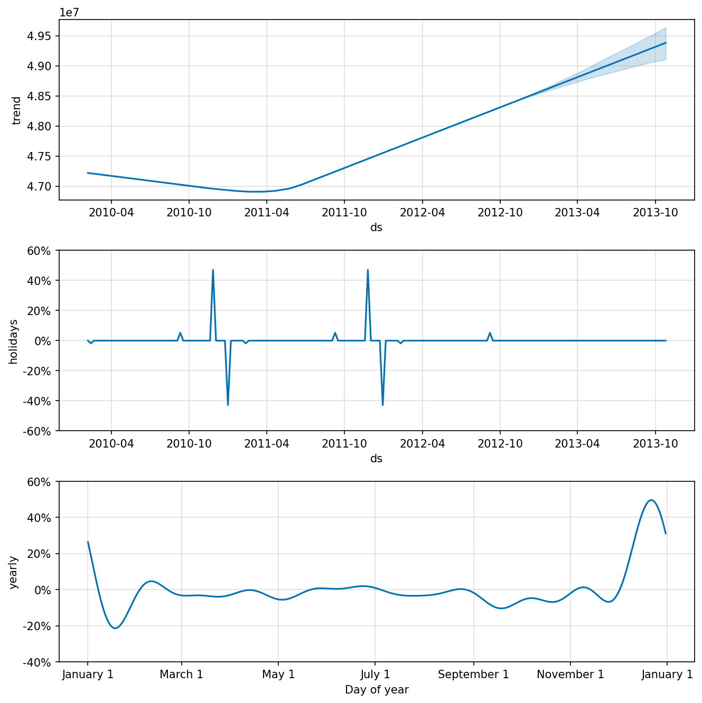
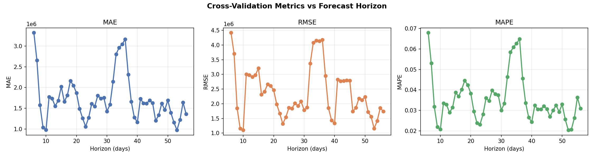

# Sales Forecast Using Prophet

A weekly sales forecasting system built with **Meta's Prophet** library, trained on Walmart store sales data. Includes trend analysis, holiday effects, cross-validation, and visual analytics.

## Features

- **Sales Forecasting**: Predict future weekly sales using Meta's Prophet time series model.
- **Holiday Effects**: Accounts for key retail events — Super Bowl, Labor Day, Thanksgiving, and Christmas.
- **Cross-Validation**: Walk-forward evaluation with MAE, RMSE, and MAPE metrics.
- **Analytics & Visualizations**:
  - Forecast with 95% confidence intervals
  - Trend and seasonality breakdown
  - Cross-validation metrics vs forecast horizon
- **Data Export**: Saves forecast results as CSV.
- **Flexible Granularity**: Forecast at total chain, per-store, or per-department level.

## Technologies Used

- **Forecasting:** Meta Prophet
- **Data Processing:** Python, Pandas, NumPy
- **Visualizations:** Matplotlib
- **Dataset:** Walmart Weekly Sales (Kaggle)

## 1. Dataset

The model expects a `train.csv` file with the following columns:

| Column | Description |
|---|---|
| `Store` | Store number |
| `Dept` | Department number |
| `Date` | Week start date |
| `Weekly_Sales` | Sales for the given store/dept/week |
| `IsHoliday` | Whether the week is a holiday week |

Download the dataset from [Kaggle - Walmart Store Sales](https://www.kaggle.com/competitions/walmart-recruiting-store-sales-forecasting/data) and place `train.csv` in the project root.

## 2. Setup

Install dependencies:
```bash
pip install prophet pandas matplotlib
```

## 3. Run the Forecast

```bash
python sales_forecast_prophet.py
```

The script will:
1. Load and explore the dataset
2. Aggregate sales based on configured granularity
3. Train the Prophet model with holiday effects
4. Run cross-validation and print metrics
5. Generate a 26-week forecast
6. Save plots and results to `forecast_outputs/`

## 4. Configuration

At the top of `sales_forecast_prophet.py`, you can adjust:

| Parameter | Default | Description |
|---|---|---|
| `GRANULARITY` | `"total"` | `"total"`, `"store"`, or `"dept"` |
| `FORECAST_WEEKS` | `26` | Number of weeks to forecast ahead |
| `TARGET_STORE` | `1` | Store number (used when granularity is `"store"` or `"dept"`) |
| `TARGET_DEPT` | `1` | Department number (used when granularity is `"dept"`) |

## 5. Prophet Model Parameters

Key hyperparameters explained:

| Parameter | Value | Description |
|---|---|---|
| `changepoint_prior_scale` | `0.05` | Controls trend flexibility — higher means more bends |
| `seasonality_mode` | `multiplicative` | Handles seasonality that grows with sales level |
| `seasonality_prior_scale` | `10` | Strength of the seasonality effect |
| `interval_width` | `0.95` | 95% confidence interval on forecasts |

## 6. Outputs

All outputs are saved to the `forecast_outputs/` folder:

| File | Description |
|---|---|
| `forecast.png` | Forecast plot with confidence intervals |
| `components.png` | Trend and yearly seasonality breakdown |
| `cv_metrics.png` | MAE / RMSE / MAPE vs forecast horizon |
| `forecast_results.csv` | Forecast values with upper and lower bounds |

## Screenshots

### 1. Forecast Plot


### 2. Components (Trend & Seasonality)
)

### 3. Cross-Validation Metrics


## Author
### SAI ASWIN KUMAR J | Email: saiaswinjanarthanan@gmail.com
